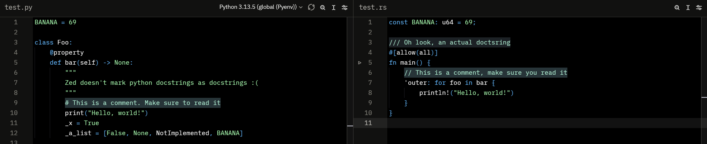

# dark as heck

When you go to hell, this is what you will see. This is a very minimalistic theme:

- The background color is `#000`
- The foreground color is `#fff`
- Keywords, punctuation and operators are blue
- Strings, numbers, and other constants are green
- Comments are highlighted to ensure you don't miss them

Zed's theming is pretty poorly documented. so I haven't styled a lot of things.
Zed seems to have good default colors that are compatible with this theme.

## How to use this

1. Clone this repository (or just copy `dark-as-heck.json` from the Github site, I won't judge)
2. If you're on linux/mac, copy `dark-as-heck.json` to `~/.config/zed/themes`
3. If you're on windows, it's probably `%APPDATA%\Zed` but I'm not sure
